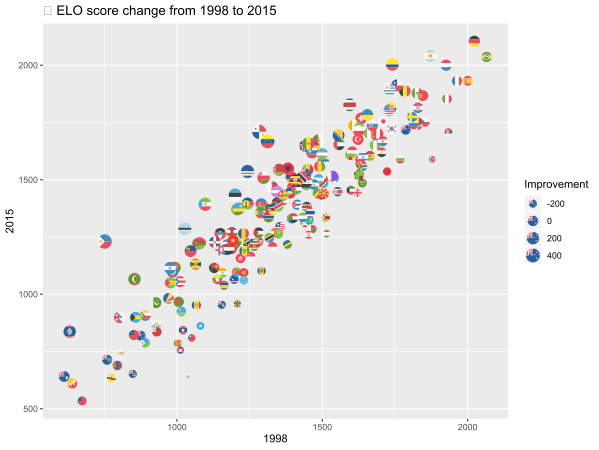
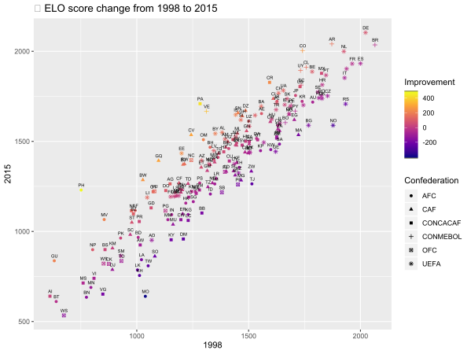
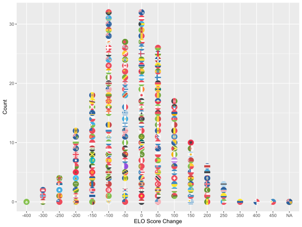
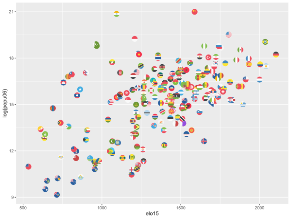

# FIFA Teams Under Blatter

This folder contains data behind the story [Blatter’s Reign At FIFA Hasn’t Helped Soccer’s Poor](http://fivethirtyeight.com/features/blatters-reign-at-fifa-hasnt-helped-soccers-poor/).

Header | Definition
---|---------
`country` | FIFA member country
`elo98` | The team's Elo in 1998
`elo15` | The team's Elo in 2015
`confederation` | Confederation to which country belongs
`gdp06` | The country's purchasing power parity GDP as of 2006
`popu06` | The country's 2006 population
`gdp_source` | Source for `gdp06`
`popu_source` | Source for `popu06`

## Analysis

### Improvements by Country

#### With Flags

#### via Confederations

#### Outliers
The distribution shows us, which teams had an extraordinary change from 1998 to 2015.

### Population based findings
China and India have a vast population, so we take a look at log(population).
Higher means better performance in terms of population.

Looking at this graph, let us find a function which determines the upper bound for a population's ELO score.